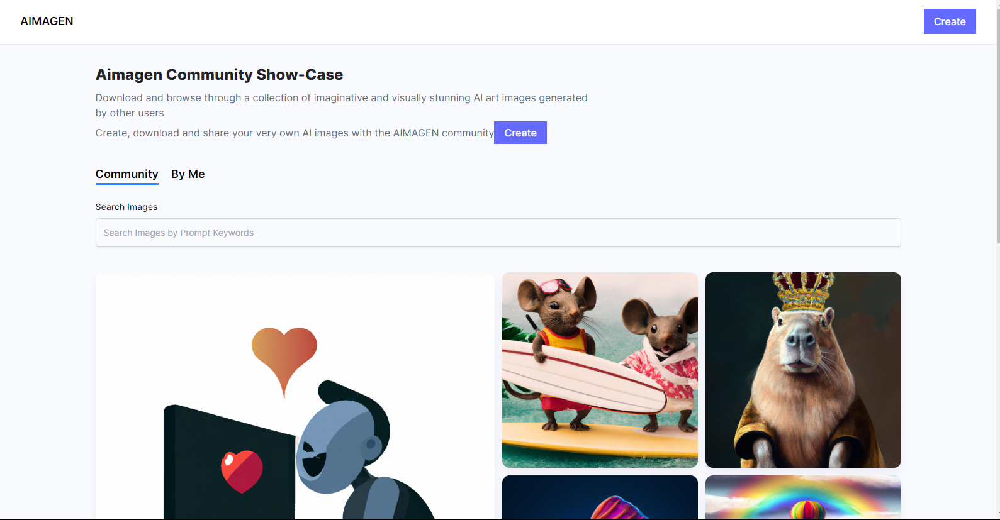
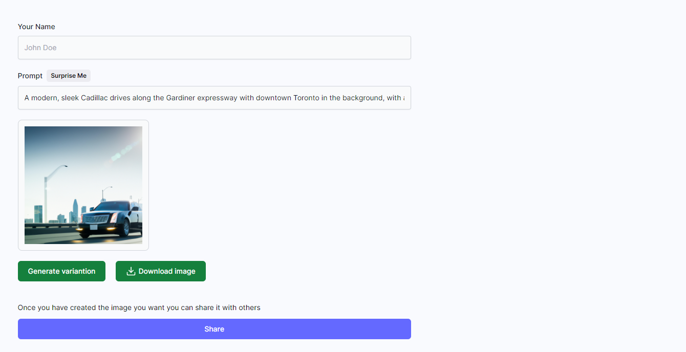

# Getting Started with AIMAGEN
This is MERN Stack project for an Ai image Generator

# Preview Image1

# Preview Image2

## Run Frontend

1. Clone this repository
2. cd in to client folder
3. install the dependencies  using `npm i`
4. in the Home and createPost page files replace the server url `https://dalle-qgms.onrender.com` with `http://localhost:3000/` or any url that will ponit to your server.
5. run the project useing  `npm run dev`

## Run Server

1. Clone this repository
2. cd in to server folder
3. install the dependencies  using `npm i`
4. create a readme file in the root of the folder.
5. Generate an Open AI key and store it in the readme. More info can be found here https://openai.com/
6. Create a mongo DB collection and store the URL in the readme file.
7. create a cloudinary account and store the credentials in the readme file
8. here is an example of the the readme
OPENAI_KEY="your key"
MONGODB_URL="your url"
CLOUDINARY_NAME="name here"
CLOUDINARY_API_KEY="api key"
CLOUDINARY_API_SECRET="your secrete"

9. run your project with `npm i` and your frontend should be able to communicate with the backend

10. Give this repo a star😎